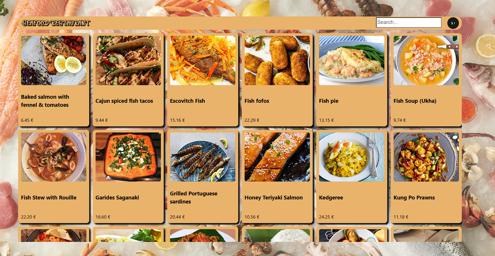
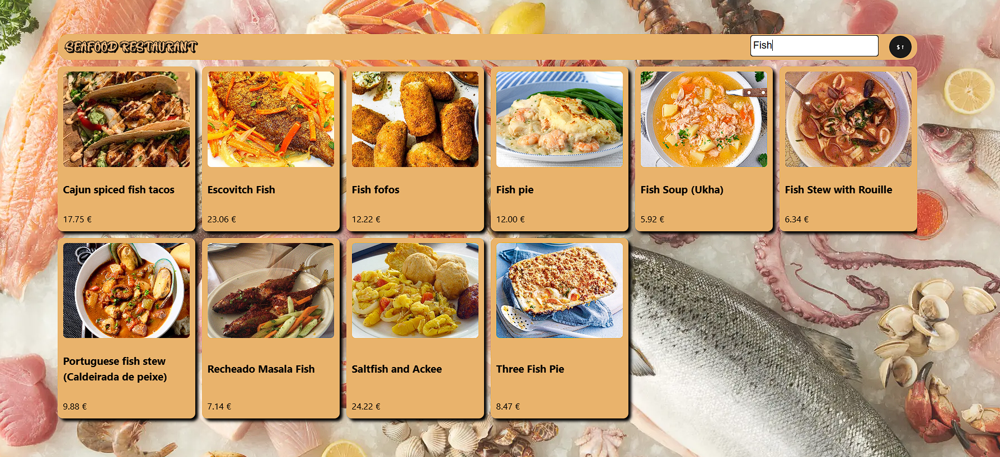

En esta tarea debiamos consumir una API dada por el docente, y plantear una carta de un restaurante usando los datos de esta mendiante el uso del Endpoint dado.

Valiendonos de la funcion fetch() de React, he creado una funcion async que ha llamado a los datos alojados en la API y devuelto los datos formateados.

He creado 3 componentes en total, MenuList, que era el componente principal que contenia todos los platos, y MenuItem, que es cada tarjeta individual de cada plato. 

Mediante props he pasado los datos que he llamado de la api con mi funcion en App.jsx, primero he pasado el array entero a MenuList, y luego en MenuList he usado la funcion map() para recorrer el array pasando cada dato de cada plato individual para crear su tarjeta correspondiente y devolverla, creando asi la cuadricula. 

El tercer componente creado ha sido Navbar que me ha servido de ayuda para crear las dos funcionalidades extras, que son la de ordenar y la de busqueda por nombre. Mediante funciones callback he pasado los datos que introducía en la caja de busqueda del Navbar, para que al llamar yo a la función que consume la API, le pase un parametro extra, que sea el que me filtre la busqueda, asi que realmente cuando la funcion llame a la funcion solo le devuelve el array que cumpla los criterios de búsqueda.
